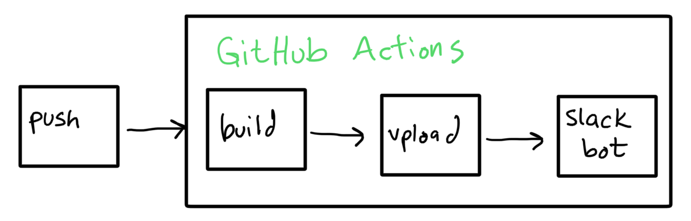

# Deploying your experiment

Deploying (or hosting) your experiment involves building the web application and then transferring a copy of the files to a suitable public website where participants can access them.

The steps to deploy are... 
1. **Use `git` to push changes to a branch of the repo for your project**.  
1. In response, GitHub will **build your project**.
1. Next, it will **upload your files** to the [configured](/configuration) server location,
1. Finally, a bot in the gureckislab slack (`#smile-deploy`) will **send a notification** about the final URL of your project if all of this is successful, providing you with near instant feedback.



**That's really it.** :sweat_smile:

For simple things this is all you need to do.  
- If you have a more complex project with multiple experiments read the section on [organizing your deployments](#organizing-your-deployments).  
- If you run into problems try [debugging deployment issues](#debugging-deployment-issues).  
- If you want to deploy some older version of your code check out [this section](#deploying-a-specific-version-of-your-experiment). 
- If you just want to understand how this magic works jump to [understanding the deployment steps](#understanding-the-deployment-steps).


## Organizing your deployments

Once you start committing changes to your project, one key challenge becomes dealing with multiple versions of the same experiment:

> Consider this typical research project evolution: First you develop an experiment and maybe collect some pilot data.  Next, you refine the experiment based on the pilot and run a full pre-registered design.  Next, you have followup questions and run several subsequent versions.  The key question is which versions should we keep around on the deployment server? 

The idea in **🫠 Smile** is to use the structure of GitHub repos to help organize the versions of your files as well as keep the data linked to the code that generated it.  To do this we use an adapation of [semantic versioning](https://semver.org).  You've probably seen software with versions like 1.0.1 or 2.3.12.  This is known as semantic versioning and has the general format `MAJOR.MINOR.PATCH`.  Major versions make incompatible API changes.  Minor versions are incremented when you add functionality/features in a backward-compatible manner.  And patches increment when you make backward-compatible bug features.

The sequential, number-based system makes sense for simple software projects where there is one "product".  However, in behavioral research, we often have multiple development paths (experiments) and they have conceptual meanings that are not well served by a numbering system.


Instead **🫠 Smile** use GitHub as a project organizing tool.


### Using GitHub as an project organizing tool


At the top level of GitHub is the **user account**.  For example, my username is `gureckis`.  Within my user account, there are several repositories for different projects.  The idea in **🫠 Smile** is each new research project gets its own **repository** (repo). Within each repo there are any number of **branches**.  Branches are offshoots of an original code base which can be used for parallel development on a project.  Branches can be merged into one another and shuffled around.  However, we will primarily use them as parallel pipelines capturing different **experiments**.  So conceptually, branches = experiments.  


```
gureckis                 <--- github username
├── another_project      <--- repository
│   └── exp1
    └── pilot      
└── my_cool_project      <--- repository
    ├── exp1             <--- branches for experiments
    ├── exp2
    ├── exp2b
    └── pilot
```


Next within a branch, we will often make a sequence of commits as we implement features, adjust bugs, and so forth.  Generally, these advance forward in a sequence automatically but sometimes it is helpful to reference some particular moment in the development of an experiment.  For this, we use git tags as a final organizing element.  At this final level we adopt the semantic versioning format but with only two values: MAJOR.PATCH.  The MAJOR counter starts at 0 and is incremented for each major release/change to the experiment that you wish to "mark".  PATCH is automatically incremented starting at 0 each time a commit is made to a given branch.


For each of these paths we can create a unique deploy path
`gureckis/another_project/pilot/0.0/` or `gureckis/my_cool_project/exp2b/1.0/`.

One reason for keeping all versions is if you later want to share links to the different experiments to reviewers or readers of the paper.  

How do we deal with small changes though?  Like you deploy "experiment 2" run 5 subjects and then realize there was a small bug which you fix and then re-deploy.  How do we keep track of which one is the "real" experiment 2 and help experimenters keep track of things?


## What commits trigger a deployment?

Any commit on any branch that modifies a file in your project will generate a deployment.  The exception is changes that only effect the `docs/` directory.  Additionally, branches names `analysis`, `models`, and `docs` will not generate a deployment with the assumption is this is where you can track code for these purposes. [TODO]

## Deploying a specific version of your experiment

Sometimes it can be helpful to re-deploy an older version of the code (e.g., sharing with a reviewer or collaborator).  Using GitHub hashes (which index individual commits) this is possible. [SET THIS UP]

The code in these folders is deleted every 90 days to save space.

[TODO]


## Debugging deployment issues

- Check that you can build the project
- Verify you have configured the secrets for your app
- Check the github actions panel on the website for logs
[TODO]

## Understanding the deployment steps
 
Smile deployment is **continuous and automatic** by design.  The purpose of continuous deployment is so that new changes to the code are always placed into a live server environment (which is then helpful for [integration testing](/testing)).
The purpose of automating deployment is to make it one less thing you need to think about.  However, if something goes wrong, or you need to customize things, it can be helpful to understand the steps.

Deploying a website involves several steps: triggering the GitHub Actions deployment process, configuring the site, building the site, and uploading the files to a suitable internet-accessible server.

### The Github Actions deployment trigger

GitHub Actions are a feature of GitHub that allows customizable scripts to run on a cloud computer instance whenever certain events happen on a repository.  Examples include running a script when someone leaves a comment on a repo or opens a pull request.  Scripts can also run automatically anytime a push is made to the repository.  In the case of Smile the deployment script is triggers with any push to the repository excluding the documentation folder (`docs/`).  This runs the action located at `.github/workflows/deploy.yml`.  Even without a lot of knowledge about GitHub action you can read this script and understand the basic logic.

### Building the site

The first step of the GitHub action runs a sequence of shell commands on a linux cloud instance hosted by GitHub (`runs-on: ubuntu-latest`).
Next, the current version of the code (after the commit) is checked out using git.  Then relevant software is installed such as Node.js.  The node dependencies are then run using `npm install`.  Then the website is build `npm run build`.  The completed website is located at `dist/`.

You can run most of the steps up to this point locally by just typing `npm run build`.

### Uploading files to an Internet-accessible server

Next, the GitHub action uploads the files to the server using rsync.
The remote host, folder, and other options are set using GitHub Secrets which are encrypted environment variables which you configure on the repository settings.

:::danger To-do
Will need to add information about these 
:::


---

:::tip Notes from lab meeting

- not every push needs to increment a counter, some are just daily code-check ins and fixing minor typos
- maybe keep copies of files around for old versions for replicability
- git branches might be a useful organizing structure for different experiments (respecting the parallel development that sometimes happens).  one version of that is that files are uploaded to a url like `http://smile.gureckislab.org/exps/my_cool_exp/branchname-v1.0.1/`
- every push could make a new version of the code but some clean-up code could run every 30 days deleting any project folders which resulted in no data
:::

