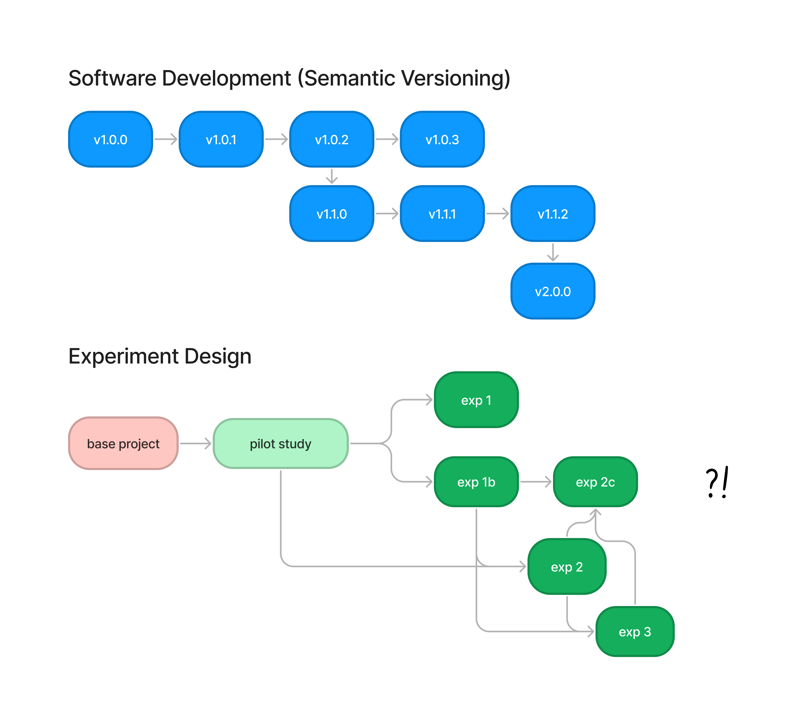
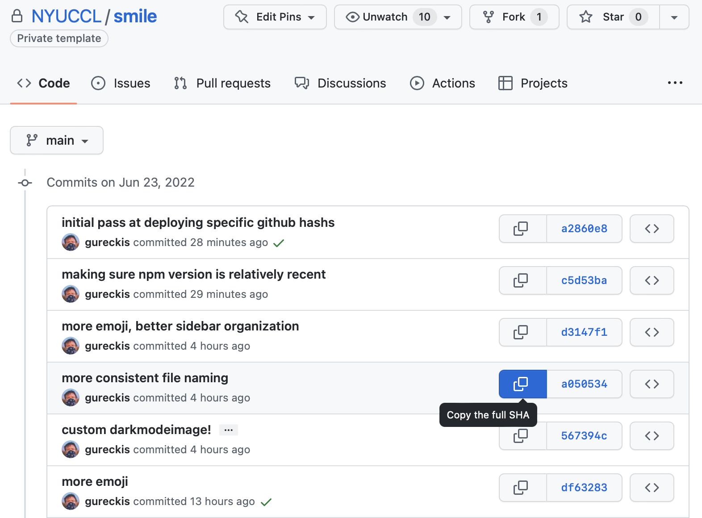
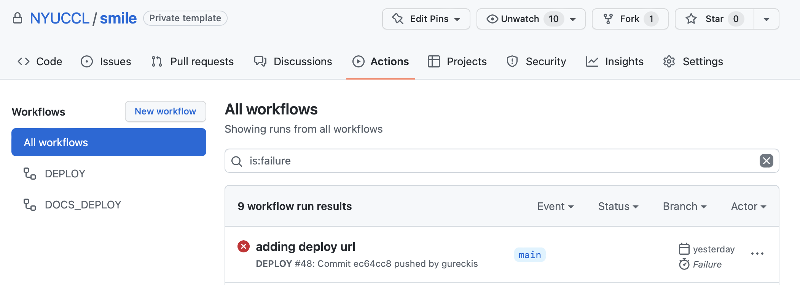

# :cloud: Deploying your experiment

Deploying (or hosting) your experiment involves building the web application and then transferring a copy of the files to a suitable public website where participants can access them.

The steps to deploy are... 
1. **Use `git` to push changes to a branch of the repo for your project**


In response, GitHub will automatically
1. **Build your project**
1. **Upload your files** to the [configured](/configuration) server location
1. **Notify a bot** in the <GureckisLabText/> slack (`#smile-deploy`) about the final URL of your project (or if there is an error)


This process provides you with nearly instant feedback on putting your code in the cloud.

**That's it!** :sweat_smile:

For most people this is all you need to do.  But there is more:
- If you have a more complex project with multiple experiments read the section on [organizing multiple versions of your experiment](#organizing-versions-of-your-experiment).  
- If you run into problems try [debugging deployment issues](#debugging-deployment-issues).  
- If you want to go back in your development history and deploy some older version of your code check out [this section](#deploying-a-specific-version-of-your-experiment). 
- If you just want to understand how this magic works jump to [understanding the deployment steps](#understanding-the-deployment-steps).

## What type of commits trigger an automatic deployment?

By default, any commit on any branch that modifies a file in your project will generate a deployment.  The concept here is "[continuous deployment](https://en.wikipedia.org/wiki/Continuous_deployment)" where things just are always synced with the online website.  The exceptions are: 
- Changes that only affect files in the `docs/` directory do not generate a deployment.
- Additionally, pushes to branches name either `analysis`, `models`, or `docs` will not generate a deployment with the assumption is this is where you can track code for these purposes and are not relevant to the deployment logic.

If you would like the deployment workflow to ignore additional files, folders, or branches see the starting section of `.github/workflows/deploy.yml`.


## Organizing versions of your experiment

Once you start committing changes to your project, one key challenge becomes dealing with multiple versions of the same experiment:

> Consider this typical research project evolution: First you develop an experiment and maybe collect some pilot data.  Next, you refine the experiment based on the pilot and run a full pre-registered design.  Next, you have followup questions and run several subsequent versions.  The key question is which versions should we keep around on the deployment server? 

The idea in <SmileText/> is to use the structure of GitHub repos to help organize the versions of your files as well as keep the data linked to the code that generated it.  To do this we use an adapation of [semantic versioning](https://semver.org).  You've probably seen software with versions like 1.0.1 or 2.3.12.  This is known as semantic versioning and has the general format `MAJOR.MINOR.PATCH`.  Major versions make incompatible API changes.  Minor versions are incremented when you add functionality/features in a backward-compatible manner.  And patches increment when you make backward-compatible bug features.

The sequential, number-based system makes sense for simple software projects where there is one "product".  However, in behavioral research, we often have multiple development paths (experiments) and they have conceptual meanings that are not well served by a numbering system.



Instead, <SmileText/> uses GitHub as a project organizing tool.


### Using GitHub as a project organizing tool


At the top level of GitHub is the **user account**.  For example, my username is `gureckis`.  

Within my user account, there are several repositories for different projects.  The idea in <SmileText/> is each new research project gets its own **repository** (repo). 

Within each repo, there is any number of **branches**.  Branches are offshoots of an original code base that can be used for parallel development on a project.  Branches can be merged into one another and shuffled around.  However, we will primarily use them as parallel pipelines capturing different **experiments**.  So conceptually, branches = experiments.  


```
gureckis                 <--- github username
├── another_project      <--- repository
│   └── exp1
    └── pilot      
└── my_cool_project      <--- repository
    ├── exp1             <--- branches for experiments
    ├── exp2
    ├── exp2b
    └── pilot
```

For each branch, a unique "deploy path" is created which is more or less a URL path to your code.  Example are:
`gureckis/another_project/pilot/` or `gureckis/my_cool_project/exp2b/` which when uploaded to a website turn into something like `http://exps.gureckislab.org/gureckis/another_project/pilot/`.

So, the steps to make a project are to follow the steps to start a new project and then use new branches to manage different experiments.

Each time you need a new branch the following commands will help.  For example, to create a new branch call `pilot` we make the branch locally and push it to the GitHub repo. 

```
git branch -m pilot
git push origin -u pilot
```

This generates a deployment which means you'll get a new URL for your project immediately.

For hand reference if you ever want to delete a branch (e.g., `pilot`) you have to do this both locally and remotely:

```
git branch -d pilot
git push origin --delete pilot
```

You shouldn't fear making branches for your projects.  So `pilot` and `exp1` and `exp1-pre-pilot` or `exp1b` are all fine.


## What URL do you send participants to?

The default deploy which combines your github username, project, and branch (e.g., `gureckis/my_cool_project/exp2b/`) turns into something like `http://exps.gureckislab.org/gureckis/another_project/pilot/` on your website.  One issue is this includes information about yourself and even the location of your code!  As a result <SmileText/> automatically creates a "code name" for your project.  This is a deterministic hash of your project deployment into a string of readable words (e.g., `hike-shark-kite`).  A symbolic link is made to your normal deploy path on your server automatically.  As a results you get a second URL like `http://exps.gureckislab.org/e/hike-shark-kite`.  This code name URL can be shared publically without exposing information.  See configuration options for more information.


## Deploying a specific version of your experiment

Sometimes it can be helpful to re-deploy an older version of the code (e.g., sharing with a reviewer or collaborator).  Using GitHub hashes (which index individual commits) this is possible.  Go to your repository on github: `https://github.com/user/repo/commits/main` (replacing user/repo with your username and the name of your project repo).  This will present you with a list of past commits you can navigate which looks like this:  




Find the commit you want to deploy publically and click the button with two boxes to copy the full hash value for that commit to your clickboard.  Then run the following command:

```
gh workflow run deploy-hash.yml -f github_sha=XXXXX 
```

replacing `XXXXX` with the hash you have in your clipboard (it is a long sequence of letters and numbers).  This will deploy that version of the code to a special 
deploy path `hashes/user/project/SHORTHASH/` where `SHORTHASH` is replaced with the first 7 characters of that hash value you requested.  This way you can share a live link to any arbitrary and specific version of the code with people.


## Debugging deployment issues

Sometimes a deployment can fail due to an error in your code or your setup.  When possible an error message will be posted to `#smile-deploy` by the slack bot.  However, sometimes even this fails.  In any case, if you don't get a notification that your app deployed here are some useful hints for fixing things.

First, check the `#smile-deploy` slack channel and see if there are any relevant messages.

Second, make sure you have a set of `.env.*.local` files in the `env/` folder (created using `git secret reveal` for <GureckisLabText/>) and have run the `npm run config:upload` command (refer back to the [initial setup instructions](starting)).  This latter command uploads some specific configuration options to GitHub which are needed for your deployment to run.  You can verify these have been set by going to your repository on the GitHub website, clicking Settings, then "Secrets".  There should be several repository secrets including `SECRET_APP_CONFIG` and `EXP_DEPLOY_PATH`, etc...

Third, run the `npm run build` and `npm run preview` commands and verify that these steps are completed without error on your local machine.  If there are errors they may be preventing GitHub from building your site.  Fix the errors locally and push the changes.

Finally, go to the GitHub repo for your project on the github.com website and click the "Actions" tab.  This will show a history of recent "workflow" runs.  Runs that fail will have a red :x: next to them.  Clicking on this will lead to a "transcript" of the run which can provide some debugging hints.




## Understanding the deployment steps

Deployment is **continuous and automatic** by design.  The purpose of continuous deployment is so that new changes to the code are always placed into a live server environment (which is then helpful for [integration testing](/testing)).
The purpose of automating deployment is to make it one less thing you need to think about.  However, if something goes wrong, or you need to customize things, it can be helpful to understand the steps.

Deploying a website involves several steps: triggering the GitHub Actions deployment process, configuring the site, building the site, and uploading the files to a suitable internet-accessible server.

### The Github Actions deployment trigger

GitHub Actions are a feature of GitHub that allows customizable scripts to run on a cloud computer instance whenever certain events happen on a repository.  Examples include running a script when someone leaves a comment on a repo or opens a pull request.  Scripts can also run automatically anytime a push is made to the repository.  In the case of Smile the deployment script is triggered with any push to the repository excluding the documentation folder (`docs/`).  This runs the action located at `.github/workflows/deploy.yml`.  Even without a lot of knowledge about GitHub action you can read this script and understand the basic logic.

### Building the site

The first step of the GitHub action runs a sequence of shell commands on a Linux cloud instance hosted by GitHub (`runs-on: ubuntu-latest`).
Next, the current version of the code (after the commit) is checked out using git. 

Next, several scripts run to optimize the environment for the app and configure it.  Then relevant software is installed such as Node.js.  The node dependencies are then run using `npm install`.  Then the website is built `npm run` build`.  The completed website is located at `dist/`.

You can run most of the steps up to this point locally by just typing `npm run build`.

### Uploading files to an Internet-accessible server

Next, the GitHub action uploads the files to the server using rsync.
The remote host, folder, and other options are set using GitHub Secrets which are encrypted environment variables that you configure on the repository settings.  Generally in the <GureckisLabText/> these will be set for you, but read more about [configuration options](configuration) to customize or adjust.

### Notifying the Slack bot
In the <GureckisLabText/>, the final step is to send a notification about the deployment to a Slack [Workflow Builder](https://slack.com/help/articles/360035692513-Guide-to-Workflow-Builder) bot.  This lets you verify the code was deployed and provides you with an up-to-date URL to share with participants.

If the deployment script fails, GitHub will attempt to notify the slack bot about the error.  However, it requires that the GitHub secrets have been properly uploaded with `npm run config:upload` so the absence of an error notification isn't proof things did work.

## Blocking web crawlers

It usually makes sense not to have Google and other search engines index your experiment deployments.  For this we recommend installing a [robots.txt](http://www.robotstxt.org) file at the root folder of your web server containing the following:

```
User-agent: *
Disallow: /
```

In addition, the `index.html` of your project should include the `noindex` meta field:

```
<meta name="robots" content="noindex">
```

Google offers a [robots.text testing tool](https://www.google.com/webmasters/tools/robots-testing-tool) which can verify that your settings will be respected by at least Google.